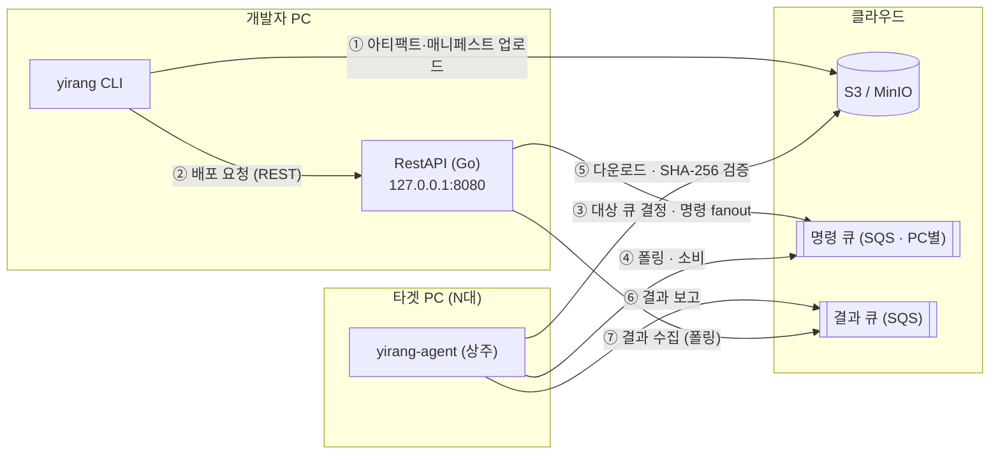
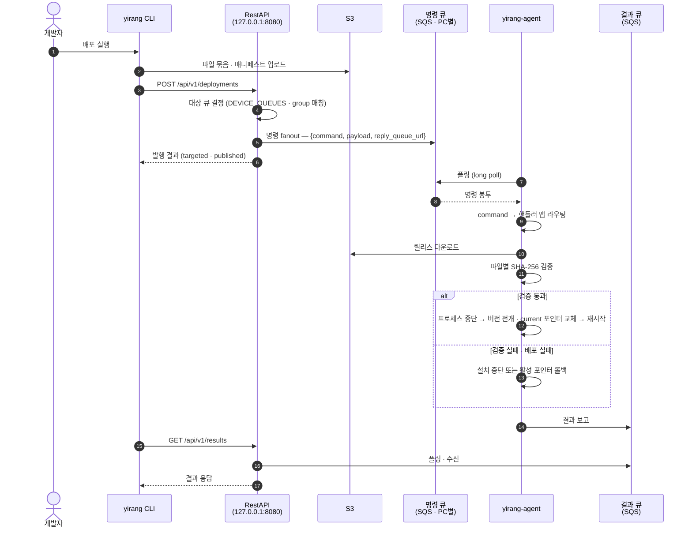
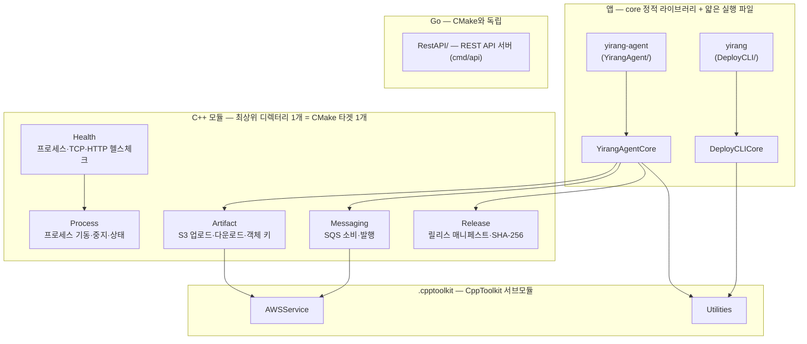
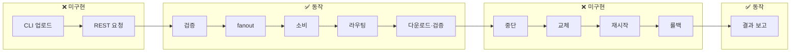

# yirang-rollout

> **S3와 메시지 큐만으로 도는 경량 배포 도구.**

`yirang-rollout`은 개발자가 CLI를 한 번 실행하면 로컬 파일 묶음을 S3에 올리고, 로컬 REST API 서버가 대상 PC들의 SQS 큐에 배포 명령을 발행해, 각 PC의 Agent가 **프로세스를 중단하고 새 버전으로 교체한 뒤 재시작**하게 하는 도구입니다.

**중앙 운영 서버가 없습니다.** Control Plane도, gRPC 제어 채널도, 데이터베이스도 두지 않습니다. REST API 서버는 개발자 본인 머신에서 도는 로컬 인터페이스이고, 필요한 외부 인프라는 S3(또는 MinIO)와 SQS 뿐입니다.

배포가 실패하면 **활성 포인터를 되돌려 이전 버전으로 복구**합니다.

## 동작



**발행 주체는 REST API 서버**입니다. CLI는 어느 큐로 나가는지 알지 못하므로, 대상 PC가 늘어도 개발자 PC의 설정은 그대로입니다.

**파일은 API 서버를 거치지 않습니다.** CLI가 S3에 직접 올리고 Agent가 S3에서 직접 내려받으므로, API 서버는 릴리스 크기에 영향을 받지 않습니다.

화살표는 **연결을 여는 방향**입니다. 타겟 PC에서는 나가는 화살표만 있습니다 — Agent가 큐를 폴링하고 S3에서 내려받을 뿐, 인바운드 연결을 받지 않습니다.

### 배포 시퀀스



## 핵심 원칙

- **인바운드 연결 불필요** — Agent가 SQS를 폴링하고 S3에 아웃바운드로 접근합니다. NAT·방화벽 뒤에서 동작합니다.
- **검증 전에 실행하지 않음** — SHA-256이 매니페스트와 다르면 설치하지 않고 중단합니다.
- **제자리 덮어쓰기 금지** — 버전 디렉터리에 풀고 `current` 포인터만 교체합니다. 롤백이 포인터 되돌리기로 끝나고, Windows 파일 잠금 문제도 피합니다.
- **멱등** — 같은 `release_id` 명령을 다시 받아도 결과가 같습니다.
- **API 서버는 로컬 전용** — 인증이 없으며, 그 전제가 성립하도록 기본 루프백 바인딩을 강제합니다(아래 참조).

> **타겟 PC의 S3 자격증명**: 현재 Agent는 SDK 기본 자격증명 공급자로 S3를 직접 읽습니다. pre-signed URL 발급(`presign`)은 `Artifact/` 경계에 구현되어 있으나 배포 경로에 연결되어 있지 않습니다. "타겟 PC에 비밀값을 두지 않는다"는 목표이지 현재 상태가 아닙니다.

## 보안 모델

REST API 서버에는 **인증이 없습니다.** 의도된 선택입니다.

배포하는 개발자는 어차피 자기 머신에 AWS 자격증명을 두고 있어야 합니다(S3 업로드·SQS 발행 모두 그 자격증명으로 나갑니다). API 서버는 그 자격증명을 감싸는 껍데기이지 보호 장벽이 아닙니다. `127.0.0.1:8080`에 닿을 수 있는 사람은 이미 `~/.aws/credentials`도 읽을 수 있으므로, 앞에 토큰을 세워도 실질적으로 막는 것이 없습니다.

이 전제가 실제로 성립하도록 두 가지를 강제합니다.

| 강제 | 내용 |
|------|------|
| 기본 루프백 바인딩 | `BIND_ADDRESS` 기본값이 `127.0.0.1`입니다. 루프백이 아니면 기동 시 경고를 남깁니다 |
| `Content-Type: application/json` 필수 | 개발자가 방문한 악성 페이지의 cross-origin 폼 POST를 브라우저 preflight 단계에서 차단합니다 |

**전제가 깨지는 경우** — `BIND_ADDRESS=0.0.0.0`으로 띄우거나, Docker에서 `-p 8080:8080`(모든 인터페이스에 게시)을 쓰거나, 팀 공유 서버에 올리는 경우입니다. 그때는 같은 네트워크의 누구나 플릿 전체에 `clean_old_version`을 쏠 수 있으므로 인증 구현이 선행되어야 합니다. Docker에서는 `-p 127.0.0.1:8080:8080`을 쓰십시오.

상세는 [`RestAPI/README.md`](RestAPI/README.md)를 참조합니다.

## 설치 레이아웃

```text
<version_root>/
├── rel_20260808_1/     이전 릴리스 (keep_previous_releases 만큼 보관)
└── rel_20260808_2/     신규 릴리스

<service_root>/         실제 서비스 경로 — apply_version 만 건드립니다
```

`version_root`와 `service_root`가 같으면 `clean_old_version`이 가동 중인 앱을 지우므로 설정 검증에서 거부합니다.

## 설정

설정은 세 벌이며 서로 겹치지 않습니다.

**CLI (`DeployCLI/yirang_deploy_configurations.json`)** — REST 주소와 출력 형식만 다룹니다.

```json
{
  "control_plane_url": "http://127.0.0.1:8080",
  "api_token": "",
  "request_timeout_seconds": 30,
  "output_format": "table"
}
```

**REST API (환경변수)** — 대상 큐 목록을 소유합니다.

```bash
DEVICE_QUEUES='[{"name":"kiosk-seoul","url":"https://sqs.…/pc-001","group":"kiosk"}]'
RESULT_QUEUE_URL=https://sqs.…/yirang-results
AWS_REGION=ap-northeast-2
```

**Agent (`YirangAgent/yirang_agent_configurations.json`)** — 자기 큐와 로컬 경로만 다룹니다.

```json
{
  "device_id": "kiosk-seoul-001",
  "group": "kiosk",
  "queue_url": "https://sqs.…/pc-001",
  "result_queue_url": "https://sqs.…/yirang-results",
  "poll_wait_seconds": 20,
  "version_root": "C:/ProgramData/yirang/versions",
  "service_root": "C:/Program Files/KioskApp",
  "keep_previous_releases": 2,
  "s3_bucket": "yirang-releases",
  "s3_region": "ap-northeast-2"
}
```

## 배포 명령

큐로 오가는 봉투는 `{command, payload, reply_queue_url}` 세 필드입니다. Agent는 `command`로 핸들러 맵에서 처리기를 찾습니다.

| 명령 | 동작 |
|------|------|
| `download_version` | 릴리스를 `<version_root>/<release_id>/`로 내려받고 파일마다 SHA-256 검증 |
| `apply_version` | 프로세스 중단 → 교체 → 재시작 |
| `current_status` | 디스크 용량·코어 수·받아둔 버전 목록 보고 |
| `clean_old_version` | `version_root` 하위 정리 |
| `rollback_version` | 지정 버전으로 되돌리기 |

## 개요

| 항목 | 내용 |
|------|------|
| 언어 표준 | C++23 (CLI · Agent) + Go 1.23+ (REST API 서버 한 곳) |
| 빌드 시스템 | CMake 3.21+ (Ninja 권장) / Go 모듈 |
| 패키지 관리 | vcpkg (`~/vcpkg`) / Go modules |
| 지원 플랫폼 | Windows x64 / Linux x64 (macOS는 개발용) |
| CppToolkit | submodule 포함 (`.cpptoolkit`) — Utilities · ThreadPool · AWSService |
| 외부 인프라 | S3(또는 MinIO) · SQS |
| 테스트 | Google Test + ctest (C++) / `go test -race` (Go) |

## 구조



화살표는 `target_link_libraries` 실측 방향(소비 → 피소비)입니다. `Process`·`Health`는 모듈로는 완성됐지만 아직 앱 실행 파일(`yirang`·`yirang-agent`)에는 링크되지 않았습니다 — 현재는 테스트에서만 소비됩니다(아래 [진행 상황](#진행-상황) 참조).

| 경로 | 내용 |
|------|------|
| `CMakeLists.txt` | 루트 빌드 정의 (플랫폼 분기, 모듈 등록) |
| `build.sh` | macOS / Linux 빌드 |
| `vcpkg.json` | 의존성 매니페스트 (builtin-baseline 고정) |
| `tests/` | gtest (65건) |
| `scripts/` | 부가 스크립트 (build.bat) |
| `custom-triplets/` | macOS SDK 전달용 vcpkg triplet |
| `.cpptoolkit/` | CppToolkit 서브모듈 |
| `docs/` | 설계·검증 문서 (로컬 전용, .gitignore 대상) |
| `.github/` | PR 템플릿 |

C++ 모듈은 **최상위 디렉터리 1개 = CMake 타겟 1개**로 배치합니다. 소비 측은 경로 접두어 없이 `#include "ReleaseManifest.h"` 처럼 포함합니다(flat include). 앱 디렉터리(`YirangAgent/`·`DeployCLI/`)만 core 정적 라이브러리 + 얇은 실행 파일 구성이라 타겟이 2개입니다.

`RestAPI/`는 독립 Go 모듈이라 CMake 빌드와 서로를 요구하지 않습니다.

## 빌드

### macOS / Ubuntu

```bash
git submodule update --init --recursive

./build.sh                       # Release
./build.sh --debug               # Debug
./build.sh --clean               # build/ 삭제 후 재구성
./build.sh --target yirang -j 8
```

환경 변수: `VCPKG_ROOT`(기본 `~/vcpkg`), `BUILD_TYPE`, `CXX`(컴파일러 — macOS SDK 프로브에도 사용), `SDKROOT`(macOS SDK 강제 지정)

### Windows

```bat
scripts\build.bat Release
scripts\build.bat Debug --clean
```

환경 변수: `VCPKG_ROOT`(기본 `%USERPROFILE%\vcpkg`)

`build.bat`은 생성기를 지정하지 않으므로 Visual Studio multi-config 생성기가 선택됩니다. 이 경우 산출물 경로와 테스트 명령이 config 하위로 갈라집니다.

> Windows 빌드는 아직 통과하지 않습니다. `Process/` 모듈의 Windows 구현(`CreateProcessW`·Job Objects)이 없어 `CMakeLists.txt`가 `WIN32`에서 명시적으로 실패합니다.

### REST API 서버

```bash
cd RestAPI
go build ./...
DEVICE_QUEUES='[{"name":"pc-001","url":"https://sqs.…/pc-001","group":"kiosk"}]' go run ./cmd/api
```

### 산출물

| 경로 | 내용 |
|------|------|
| `build/out/yirang` | CLI |
| `build/out/yirang-agent` | Agent |
| `build/lib/` | 모듈 정적 라이브러리 |

Windows multi-config 생성기에서는 `build\out\<Config>\`, `build\lib\<Config>\` 하위로 갈라집니다.

## 테스트

```bash
cd build && ctest --output-on-failure      # C++ 65건
cd RestAPI && go test -race ./...          # Go 84건
```

Windows(multi-config 생성기)에서는 config를 명시합니다.

```bat
cd build && ctest -C Release --output-on-failure
```

S3·SQS 통합 테스트 2건은 LocalStack 환경변수(`YIRANG_TEST_S3_ENDPOINT` 등)가 없으면 건너뜁니다.

## 진행 상황

배포 경로 중 **큐를 오가는 중간 구간은 끝까지 돌고, 진입부(CLI 업로드·REST 요청)와 적용부(중단·교체·재시작·롤백)가 비어 있습니다.**



| 모듈 | 상태 |
|------|------|
| S3 저장소 (`Artifact/`) | ✅ 완료 |
| SQS 소비·발행 (`Messaging/`) | ✅ 완료 |
| 릴리스 매니페스트 (`Release/`) | ✅ 완료 |
| Agent 데몬 (`YirangAgent/`) | ✅ 완료 — 명령 5종 중 3종 동작 |
| REST API 서버 (`RestAPI/`) | ✅ 완료 (인증은 의도적 제외, 상태 영속화 미구현) |
| 프로세스 제어 (`Process/`) | ⚠️ 모듈 완료(POSIX) — **Agent 실행 파일에 미링크되어 호출 경로에 없음** |
| 헬스체크 (`Health/`) | ⚠️ 모듈 완료 — **동일하게 미링크** |
| CLI (`DeployCLI/`) | 🚧 골격만 — 서브커맨드·S3 업로드·REST 호출 미구현 |
| 릴리스 설치기 · 배포 실행기 | ❌ 미착수 — `apply_version`·`rollback_version`이 이 부재를 사유로 실패를 반환합니다 |
| Windows 지원 | ❌ 미착수 — `Process/`의 Windows 구현이 없어 configure가 실패합니다 |

**차단 요인은 릴리스 설치기 하나**입니다. CLI 서브커맨드·결과 집계·Windows 지원은 서로 독립이라 병렬로 진행할 수 있습니다.

단계별 실측 판정(`file:line` 근거)과 세부 계획은 `docs/task_list.md` §1.2~1.5(로컬 전용)를 참조합니다.

## 코드 규약

- 포맷: `.clang-format` (GNU 기반, 탭 들여쓰기, 170 컬럼) — 커밋 전 `clang-format -i <파일>`
- C++ 오류는 예외가 아니라 `std::expected<T, std::string>` 반환값으로 전파합니다.
- Go는 `gofmt`·`go vet` 통과가 전제이며, 오류는 래핑해 전파하고 `errors.Is`/`errors.As`로 판별합니다.
- 명명·수명 관리·모듈 배치 규약: `docs/CODING_CONVENTION.md` (로컬 전용)

## 문서

`docs/` 하위에 설계·검증 문서를 둡니다(로컬 전용, `.gitignore` 대상). 범위의 단일 출처는 `docs/project_concept.md`입니다.

> 루트의 `yirang-rollout-architecture.md`는 **초기 설계 문서**입니다. Control Plane·gRPC·Site Relay를 갖춘 플릿 관리 플랫폼을 기술하고 있으며, 2026-08-08 재기획으로 대부분이 현재 범위를 벗어났습니다. 플랫폼 추상화(§17)·릴리스 디렉터리(§18)·헬스체크(§22) 등 일부만 유효합니다.
