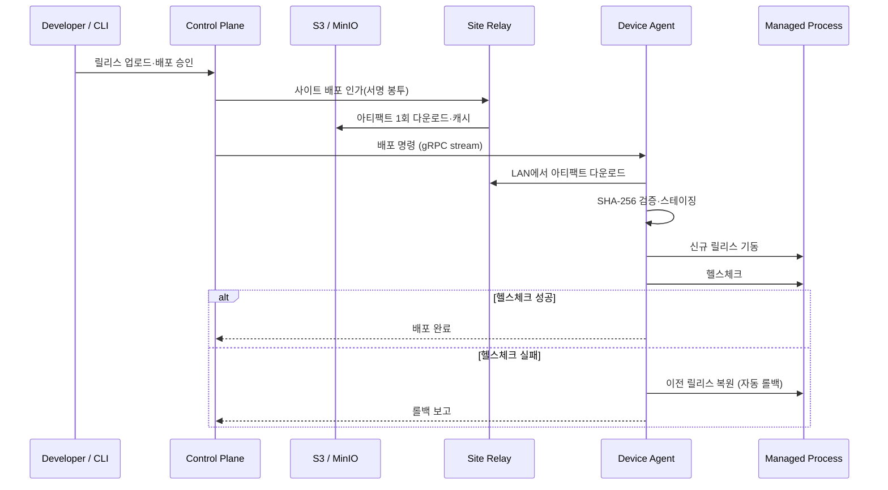

# yirang-rollout

> **Lightweight zero-downtime deployment for Windows and Linux edge devices.**

`yirang-rollout`은 키오스크·임베디드 장비·엣지 시스템의 네이티브 애플리케이션을 배포하는 agent 기반 릴리스 플랫폼입니다. 서명된 아티팩트, 헬스체크 롤아웃, 자동 롤백, blue-green 프로세스 전환, 플릿 관리, 오프라인 내성을 가진 Site Relay 기반 사이트 로컬 배포를 지원합니다.

Kubernetes 대체제가 아닙니다. 컨테이너 오케스트레이션이나 클러스터 수준의 운영 복잡성 없이, 명시적으로 등록된 엣지 디바이스에 대한 네이티브 실행 파일 배포와 복구에 집중합니다.

상세 설계는 [`yirang-rollout-architecture.md`](yirang-rollout-architecture.md)를 참조하십시오.

## 개요

| 항목 | 내용 |
|------|------|
| 언어 표준 | C++23 (Agent · Site Relay · Local Gateway · CLI) / Go (Control Plane, 예정) |
| 빌드 시스템 | CMake (Ninja 권장) |
| 패키지 관리 | vcpkg (`~/vcpkg`) |
| 지원 플랫폼 | Windows x64 / Linux x64·ARM64 (macOS는 개발용) |
| CppToolkit | submodule 포함 (`.cpptoolkit`) |
| 테스트 | Google Test + ctest |
| 인프라 | PostgreSQL · RabbitMQ · Redis · S3/MinIO (Control Plane 측) |

## 핵심 원칙

- **아웃바운드 전용 연결**: 관리자는 디바이스에 직접 접속하지 않습니다. 모든 Agent와 Site Relay가 Control Plane으로 mTLS gRPC 스트림을 먼저 엽니다(인바운드 포트 불필요, NAT 뒤에서 동작).
- **제어 채널과 아티팩트 채널 분리**: 제어는 gRPC 양방향 스트리밍, 아티팩트는 S3 pre-signed URL / Site Relay LAN HTTPS / Cloud Relay 폴백.
- **아티팩트 불변·내용 주소 저장**: SHA-256 검증, 버전별 불변 릴리스 디렉터리.
- **롤백 우선 설계**: 모든 배포 단계가 영속화되고, 실패 시 자동 롤백과 watchdog 복구가 1급 경로입니다.

## 실행 흐름



## 구조

```
yirang-rollout/
├── CMakeLists.txt          # 루트 빌드 정의 (플랫폼 분기, 옵션)
├── build.sh                # macOS / Linux 빌드
├── vcpkg.json              # 의존성 매니페스트 (builtin-baseline 고정)
├── Main/                   # 애플리케이션 소스 (MVP 진행에 따라 agent/ 등으로 분화 예정)
├── tests/                  # gtest 테스트
├── scripts/                # 부가 스크립트 (build.bat 등)
├── custom-triplets/        # macOS SDK 전달용 vcpkg triplet
├── .cpptoolkit/            # CppToolkit 서브모듈 (공유 라이브러리)
├── docs/                   # 설계·검증 문서 (로컬 전용, .gitignore 대상)
└── .github/                # PR 템플릿
```

목표 모노레포 레이아웃(`protocols/`, `agent/`, `site-relay/`, `control-plane/`, `cli/`, `web/`, `common/`)은 아키텍처 문서 §9를 따르며, MVP 1 구현과 함께 단계적으로 확장합니다.

## 빌드

### macOS / Ubuntu

```bash
git submodule update --init --recursive

./build.sh                       # Release
./build.sh --debug               # Debug
./build.sh --clean               # build/ 삭제 후 재구성
./build.sh --target yirang-rollout -j 8
```

환경 변수: `VCPKG_ROOT`(기본 `~/vcpkg`), `BUILD_TYPE`, `SDKROOT`(macOS SDK 강제 지정)

### Windows

```bat
scripts\build.bat Release
scripts\build.bat Debug --clean
```

### 산출물

| 경로 | 내용 |
|------|------|
| `build/out/` | 실행 파일 |
| `build/lib/` | 라이브러리 |

## 테스트

```bash
cd build && ctest --output-on-failure
```

## MVP 로드맵

| 단계 | 목표 |
|------|------|
| MVP 1 | 단일 디바이스 신뢰 배포 — enrollment, heartbeat, recreate 배포, 자동 롤백, watchdog |
| MVP 2 | 무중단 배포 — Local Gateway, blue-green 전환, 커넥션 드레이닝, Cloud Artifact Relay |
| MVP 3 | SaaS 플릿 관리 — RBAC, 승인, 배치 롤아웃, 감사 로그, 대시보드 |
| MVP 4 | Site Relay — 사이트 캐시(WAN 1회 다운로드), LAN 배포, 오프라인 인가 배포, 재동기화 |

## 코드 규약

- 포맷: `.clang-format` (GNU 기반, 탭 들여쓰기, 170 컬럼) — 커밋 전 `clang-format -i <파일>`
- 명명·오류 처리·수명 관리 규약: `docs/CODING_CONVENTION.md` (로컬 전용)

## 문서

`docs/` 하위에 설계·검증 문서를 둡니다(로컬 전용). 요구사항이 확정되면 SRS/SAD/STP/RTM을 작성합니다.
