# yirang-rollout Architecture

> **A lightweight edge fleet release platform for Windows and Linux kiosks, embedded devices, and native server applications.**

- Document: `yirang-rollout-architecture.md`
- Status: Architecture and implementation plan
- Primary language: C++23
- Target platforms: Windows x64, Linux x64/ARM64
- Primary deployment targets: kiosks, embedded devices, edge computers, native server applications
- Planned implementation scope: MVP 1, MVP 2, MVP 3, MVP 4

---

## 1. Executive Summary

`yirang-rollout` is an agent-based deployment and recovery platform for native executables running on Windows and Linux.

The product is designed for environments where Kubernetes is too expensive, operationally complex, or structurally inappropriate, especially:

- kiosks installed across multiple stores
- embedded equipment in hospitals, factories, laboratories, and retail sites
- Windows-based native applications
- Linux edge devices
- applications distributed as executable files or compressed binary packages
- devices operating behind NAT or restrictive firewalls
- locations with slow or intermittent internet connectivity
- environments where containerization is difficult or unnecessary

The platform is composed of four major areas.

1. **Control Plane**
   - provides SaaS APIs, release management, deployment orchestration, device management, authorization, audit records, and deployment policies

2. **Device Agent**
   - runs on each target device and performs artifact download, verification, process control, health checks, blue-green switching, rollback, watchdog recovery, and state reporting

3. **Local Gateway**
   - provides stable local service endpoints and switches traffic between old and new process instances during blue-green deployment

4. **Site Relay**
   - caches deployment artifacts at each physical site and distributes them to local devices over the LAN
   - supports offline-resilient deployment using previously authorized deployment policies

The central architectural principle is:

> The administrator never connects directly to a target device.  
> Every Agent and Site Relay initiates an outbound authenticated connection to the Control Plane.

Artifact delivery and control messaging are separated.

- **Control channel:** gRPC bidirectional streaming over HTTP/2 and TLS
- **User API:** HTTPS REST API
- **Primary artifact delivery:** S3-compatible object storage using pre-signed URLs
- **Site-local artifact delivery:** HTTPS from Site Relay
- **Fallback artifact delivery:** Control Plane Artifact Relay using HTTPS range/chunk requests
- **UDP:** not used for deployment or control

The product is not a Kubernetes replacement. It deliberately avoids container orchestration, scheduling, service mesh, cluster networking, and generalized infrastructure management. Its scope is limited to safe release delivery, process lifecycle control, health verification, rollback, device fleet visibility, and site-local distribution.

---

## 2. Product Vision

### 2.1 Vision statement

`yirang-rollout` enables teams to safely deploy and recover native Windows and Linux applications across distributed edge devices without introducing Kubernetes-level operational complexity.

### 2.2 Product positioning

The product should be positioned as:

> An Edge Fleet Release Platform for native applications.

It should not be positioned as:

- a general-purpose container orchestrator
- a Kubernetes alternative
- a full remote device management suite
- a replacement for configuration management systems such as Ansible
- an endpoint security or MDM solution
- a generic SSH-based remote execution system
- a full observability platform

### 2.3 Primary value proposition

The product solves the following operational problems.

- Safely distribute executable releases to many devices.
- Deploy without requiring inbound access to target devices.
- Recover automatically when a newly deployed process fails.
- Minimize downtime using blue-green process switching.
- Reduce WAN bandwidth using a site-local artifact cache.
- Continue authorized site deployments during temporary internet outages.
- Track which release is installed on every device.
- Provide deployment history, approval records, and auditability.
- Support both modern and legacy native applications.
- Remain deployable on a small virtual machine or affordable cloud environment.

---

## 3. Design Goals

### 3.1 Functional goals

The platform shall:

1. register Windows and Linux devices
2. maintain Agent heartbeat and online status
3. upload and version executable release packages
4. store artifacts in S3-compatible storage
5. support direct S3, Site Relay, and cloud relay artifact sources
6. verify artifact integrity using SHA-256
7. support release signature verification
8. install releases into immutable versioned directories
9. start, stop, monitor, and restart native processes
10. perform HTTP, TCP, process, or command-based health checks
11. support recreate and blue-green deployment strategies
12. support automatic rollback
13. support scheduled and batch deployments
14. support device groups and physical sites
15. provide role-based access control
16. provide audit logs
17. support Site Relay artifact caching
18. support resumable local and WAN downloads
19. continue previously approved deployments during temporary WAN failure
20. synchronize local deployment results after connectivity recovery

### 3.2 Non-functional goals

The platform should be:

- lightweight enough to run on low-resource devices
- operable without a Kubernetes cluster
- resilient to Agent and device restarts
- tolerant of unreliable networks
- idempotent
- auditable
- secure by default
- horizontally scalable at the Control Plane where needed
- usable in both cloud-hosted and self-hosted deployments
- straightforward to evaluate as a portfolio project

### 3.3 Resource goals

Initial targets:

| Component | Target idle memory | Target disk use | Notes |
|---|---:|---:|---|
| Device Agent | 30–80 MB | less than 100 MB excluding release cache | Depends on gRPC/OpenSSL linkage |
| Local Gateway | 20–60 MB | minimal | May be integrated with Agent for MVP |
| Site Relay | 80–200 MB | configurable cache | Disk use dominated by artifacts |
| Control Plane service | 100–300 MB per service | external DB/storage | May be consolidated for MVP |

These are design targets rather than strict acceptance criteria.

---

## 4. Explicit Non-Goals and Scope Boundaries

Controlling scope is essential. The project must not grow into an incomplete Kubernetes clone.

### 4.1 Features intentionally excluded

The following features are out of scope:

- container runtime management
- container image building
- pod scheduling
- multi-tenant container isolation
- cluster auto-scaling
- overlay networking
- service mesh
- persistent volume orchestration
- distributed consensus implementation
- arbitrary workload scheduling across nodes
- generalized secret management platform
- generalized infrastructure provisioning
- operating system patch management
- firmware flashing
- full remote desktop
- arbitrary shell command execution from the web console
- complete metrics and log analytics stack
- database migration orchestration as a generalized subsystem
- application-level distributed transaction management
- multi-cloud infrastructure abstraction

### 4.2 Supported workload model

A workload is a native application release containing:

- one primary executable
- optional support executables
- libraries
- configuration templates
- static assets
- optional pre-deploy and post-deploy hooks
- a deployment manifest

The platform manages the release as a unit.

### 4.3 Supported deployment model

The platform supports:

- one device or many devices
- one site or many sites
- one service or several explicitly defined services
- process replacement on a single operating system instance
- local blue-green switching when the application supports dynamic port binding
- recreate deployment for fixed-port or legacy programs
- rolling deployment across device groups

The platform does not schedule an arbitrary service onto any available machine. Devices are explicitly enrolled and assigned to projects, sites, and groups.

---

## 5. Kubernetes Differentiation

### 5.1 Comparison

| Area | Kubernetes | yirang-rollout |
|---|---|---|
| Primary workload | Containers | Native executables and release packages |
| Primary environment | Clustered server infrastructure | Kiosks, embedded devices, edge computers |
| Deployment unit | Container image and Pod | Signed release package |
| Node model | Schedulable cluster node | Explicitly registered managed device |
| Network model | Cluster networking and Services | Existing LAN/WAN and local process gateway |
| Ingress | Ingress Controller / LoadBalancer | Local Gateway or existing reverse proxy |
| Artifact source | Container registry | S3, Site Relay, cloud artifact relay |
| Offline behavior | Not a primary design target | First-class site deployment requirement |
| Windows native apps | Possible but container-oriented | Directly supported |
| Resource scheduling | Core feature | Not supported |
| Desired-state reconciliation | Generalized | Limited to deployment and process health |
| Storage orchestration | Persistent Volumes | Not supported |
| Operational burden | High | Intentionally low |
| Target operator | DevOps/platform team | Application and field operations team |

### 5.2 Architectural boundary

`yirang-rollout` only reconciles a narrow desired state:

```text
Device X should run Release Y of Service Z under Policy P.
```

It does not attempt to reconcile a complete cluster specification.

### 5.3 Scope control rule

A proposed feature should be rejected or postponed when it requires any of the following:

- generalized scheduler
- generalized service discovery
- cluster-wide overlay network
- generalized storage abstraction
- arbitrary workload placement
- generalized operator/controller framework
- large ecosystem of custom resource definitions

A proposed feature is likely in scope when it directly improves:

- artifact delivery
- device enrollment
- process deployment
- health validation
- rollback
- rollout safety
- fleet visibility
- site-local distribution
- offline resilience
- auditability

---

## 6. Primary Users and Use Cases

### 6.1 User roles

#### Platform administrator

- creates organizations and projects
- configures storage and security policies
- manages Site Relays
- assigns users and roles
- reviews audit logs

#### Release manager

- uploads artifacts
- creates releases
- approves production deployments
- controls rollout strategy
- pauses or rolls back deployments

#### Application developer

- integrates health checks
- defines runtime arguments
- creates release manifests
- monitors deployment logs

#### Field operator

- monitors devices at a physical site
- verifies offline or failed devices
- triggers permitted recovery operations
- validates local site status

### 6.2 Primary use cases

1. Deploy a new kiosk application version to 300 stores overnight.
2. Deploy to two pilot kiosks before rolling out to the rest of a site.
3. Roll back automatically when the new process repeatedly crashes.
4. Deliver a 500 MB package once per site rather than once per device.
5. Continue a previously approved deployment while the WAN is temporarily unavailable.
6. Identify devices running an outdated version.
7. Reconstruct who approved and executed a deployment.
8. Deploy to a Windows kiosk and a Linux edge computer using one Control Plane.
9. Use recreate deployment for a legacy fixed-port application.
10. Use blue-green deployment for an application that supports a configurable local port.

---

## 7. High-Level Architecture

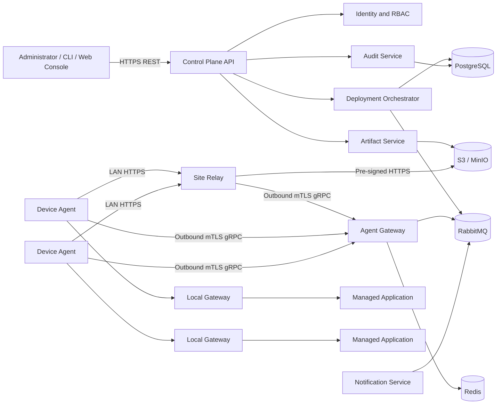

### 7.1 Component summary

| Component | Responsibility |
|---|---|
| Web Console | Fleet, release, deployment, and audit UI |
| CLI | CI/CD and developer interface |
| Control Plane API | Public management API |
| Identity/RBAC | Authentication and authorization |
| Deployment Orchestrator | Creates plans and advances deployment state |
| Agent Gateway | Maintains Agent and Relay streams |
| Artifact Service | Creates upload/download URLs and metadata |
| PostgreSQL | Source of truth |
| RabbitMQ | Asynchronous jobs and event delivery |
| Redis | Ephemeral session and connection routing state |
| S3/MinIO | Artifact storage |
| Device Agent | Device-local deployment engine |
| Local Gateway | Stable endpoint and traffic switching |
| Site Relay | Site-local cache and offline deployment coordinator |

---

## 8. Deployment Topologies

### 8.1 Cloud SaaS topology

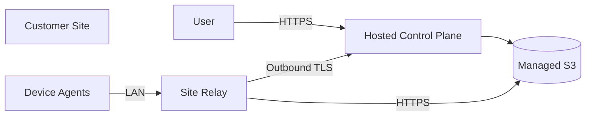

Best for:

- multiple customer sites
- centralized operations
- recurring subscription model
- minimal customer infrastructure

### 8.2 Self-hosted topology

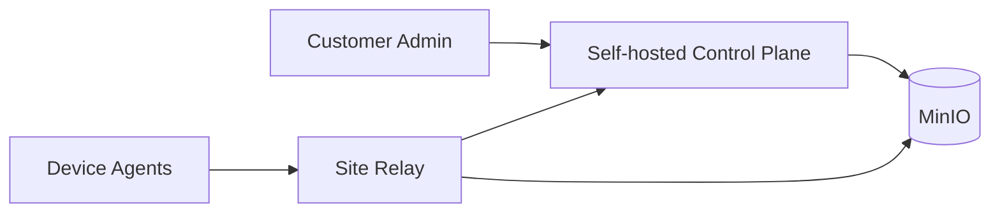

Best for:

- hospitals
- factories
- restricted networks
- private data centers
- regulated environments

### 8.3 Direct device topology without Site Relay

Small installations may omit Site Relay.

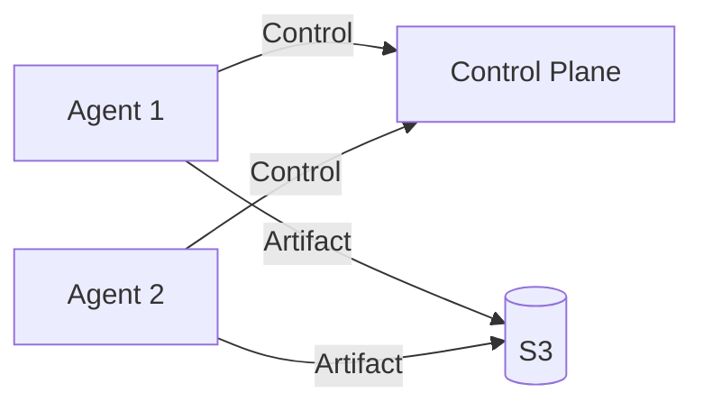

Site Relay should be optional at the architecture level but strongly recommended for multi-device physical sites.

---

## 9. Repository Structure

A monorepo is recommended until service boundaries become operationally necessary.

```text
yirang-rollout/
├── README.md
├── yirang-rollout-architecture.md
├── CMakeLists.txt
├── CMakePresets.json
├── vcpkg.json
│
├── protocols/
│   ├── agent_control.proto
│   ├── deployment.proto
│   ├── relay.proto
│   ├── artifact.proto
│   └── common.proto
│
├── agent/
│   ├── app/
│   ├── core/
│   ├── control/
│   ├── deployment/
│   ├── artifact/
│   ├── process/
│   ├── health/
│   ├── gateway/
│   ├── recovery/
│   ├── storage/
│   ├── security/
│   └── platform/
│       ├── windows/
│       └── linux/
│
├── site-relay/
│   ├── app/
│   ├── control/
│   ├── artifact-cache/
│   ├── distribution/
│   ├── offline-queue/
│   ├── rollout/
│   ├── storage/
│   └── security/
│
├── control-plane/
│   ├── api/
│   ├── auth/
│   ├── orchestrator/
│   ├── agent-gateway/
│   ├── artifact-service/
│   ├── audit/
│   ├── notification/
│   ├── domain/
│   ├── persistence/
│   └── migrations/
│
├── cli/
├── web/
│
├── common/
│   ├── model/
│   ├── crypto/
│   ├── networking/
│   ├── logging/
│   └── utilities/
│
├── samples/
│   ├── sample-http-service/
│   ├── sample-tcp-service/
│   ├── sample-worker/
│   └── sample-kiosk-app/
│
├── tests/
│   ├── unit/
│   ├── integration/
│   ├── e2e/
│   ├── fault-injection/
│   └── performance/
│
├── packaging/
│   ├── windows/
│   ├── linux/
│   └── docker/
│
└── deploy/
    ├── compose/
    ├── terraform/
    └── scripts/
```

---

## 10. Technology Stack

### 10.1 Device Agent and Site Relay

Recommended:

- C++23
- Boost.Asio
- gRPC C++
- Protocol Buffers
- OpenSSL
- libcurl
- SQLite
- zstd or LZ4
- spdlog or project logger
- CMake
- vcpkg

Optional:

- Boost.Beast for local HTTP endpoints
- cpp-httplib for simplified health checks
- AWS SDK for C++ only where required
- libsodium for local secret encryption

Prefer libcurl and pre-signed URLs over embedding the full AWS SDK in resource-constrained Agents.

### 10.2 Control Plane

Two valid implementation choices exist.

#### Option A: C++-centric

- C++23
- Drogon or Boost.Beast
- gRPC C++
- PostgreSQL
- RabbitMQ
- Redis
- MinIO/S3

Advantages:

- consistent language
- demonstrates C++ backend capability
- shared protocol and domain libraries

Trade-off:

- slower implementation of user-facing SaaS APIs

#### Option B: Hybrid, recommended

- C++23: Agent, Site Relay, Local Gateway
- Go: Control Plane API, Orchestrator, Agent Gateway
- React/TypeScript: Web Console
- PostgreSQL
- RabbitMQ
- Redis
- S3/MinIO

Advantages:

- C++ remains central to systems-level functionality
- faster SaaS development
- clear service boundaries
- demonstrates multi-language architecture

For portfolio clarity, the architecture document allows either implementation, but the recommended delivery path is the hybrid model.

---

## 11. Communication Architecture

### 11.1 Protocol selection

| Communication path | Protocol |
|---|---|
| Web Console / CLI → Control Plane | HTTPS REST |
| Agent → Agent Gateway | gRPC bidirectional stream over HTTP/2/TLS |
| Site Relay → Agent Gateway | gRPC bidirectional stream over HTTP/2/TLS |
| Agent → Site Relay | HTTPS |
| Agent/Relay → S3 | HTTPS with pre-signed URL |
| Agent → Local Gateway | Local HTTP, named pipe, or Unix domain socket |
| UDP | Not used |

### 11.2 Why TCP-based protocols are required

Deployment communication requires:

- ordered delivery
- retransmission
- authentication
- encryption
- backpressure
- resumable transfer
- precise failure reporting

Raw UDP would require reimplementing these features and would distract from the product’s deployment objectives.

### 11.3 Why raw TCP is not the primary product API

Raw TCP may be used internally by gRPC and HTTPS, but the product should expose stable application protocols rather than a custom framing protocol.

Benefits:

- well-defined authentication
- standard proxies and firewalls
- reusable tooling
- easier observability
- robust retry semantics
- schema evolution through Protocol Buffers

---

## 12. Agent Connection Model

### 12.1 Outbound-only connection

Each Agent opens and maintains a connection to the Control Plane.

```text
Device Agent ───── outbound mTLS gRPC stream ─────> Agent Gateway
```

The Control Plane does not initiate a new inbound connection to the device.

### 12.2 Benefits

- no inbound firewall rule
- no customer port forwarding
- works behind NAT
- avoids exposing device addresses
- supports changing IP addresses
- simplifies security review
- centralizes authentication and authorization

### 12.3 Connection lifecycle

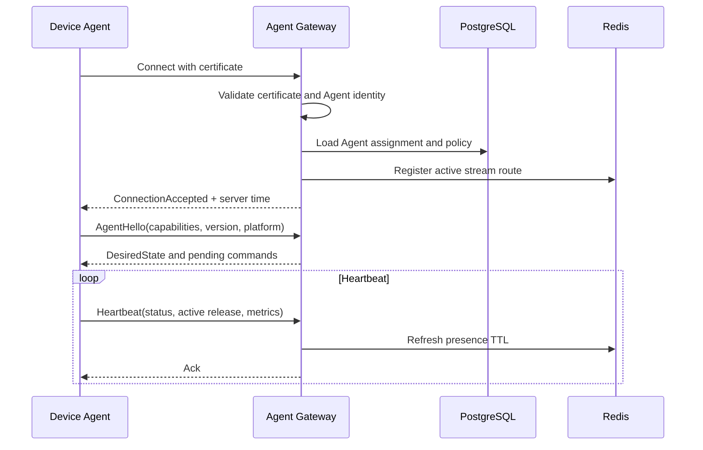

### 12.4 Reconnection behavior

The Agent shall:

- use exponential backoff with jitter
- persist pending local events
- resume the same deployment when safe
- request desired state after reconnection
- avoid repeating completed idempotent steps

Recommended backoff:

```text
1s, 2s, 4s, 8s, 16s, 30s maximum with jitter
```

---

## 13. Core Domain Model

```text
Organization
└── Project
    ├── Environment
    │   └── Service
    │       ├── Release
    │       └── Deployment
    └── Site
        ├── Site Relay
        └── Device Group
            └── Device Agent
```

### 13.1 Core entities

#### Organization

Represents a tenant or customer.

Fields:

- organization_id
- name
- plan
- status
- created_at

#### Project

Represents a product or application family.

Fields:

- project_id
- organization_id
- name
- description

#### Environment

Examples:

- development
- staging
- production

Fields:

- environment_id
- project_id
- name
- deployment_policy_id

#### Site

Represents a physical or logical location.

Examples:

- Seoul Store 001
- Factory Line A
- Hospital Building B

Fields:

- site_id
- organization_id
- name
- timezone
- network_policy
- relay_required

#### Device

Fields:

- device_id
- site_id
- device_group_id
- hostname
- platform
- architecture
- agent_version
- status
- current_release_id
- last_seen_at
- labels
- capabilities

#### Service

Fields:

- service_id
- project_id
- name
- runtime definition
- health-check definition
- deployment strategy defaults

#### Artifact

Fields:

- artifact_id
- storage key
- SHA-256
- size
- content type
- signature
- created_at

#### Release

Fields:

- release_id
- service_id
- version
- artifact_id
- manifest
- status
- created_by
- created_at

#### Deployment

Fields:

- deployment_id
- release_id
- environment_id
- target selector
- rollout policy
- status
- approved_by
- scheduled_at
- started_at
- completed_at

#### DeviceDeployment

Represents deployment state for one device.

Fields:

- deployment_id
- device_id
- state
- current_step
- progress
- failure_code
- failure_detail
- previous_release_id
- started_at
- completed_at

---

## 14. Release Package Format

### 14.1 Package layout

```text
release-package.zip
├── manifest.json
├── bin/
│   ├── kiosk-app.exe
│   └── helper.dll
├── config/
│   └── default.json
├── assets/
├── scripts/
│   ├── pre_deploy
│   └── post_deploy
└── signatures/
    └── manifest.sig
```

Hooks should be disabled by default and constrained when enabled.

### 14.2 Manifest example

```json
{
  "schema_version": "1.0",
  "service": {
    "name": "kiosk-client",
    "version": "2.3.0"
  },
  "platform": {
    "os": "windows",
    "architecture": "x86_64"
  },
  "artifact": {
    "sha256": "9fb35a73...",
    "size": 18234612,
    "compression": "zip"
  },
  "runtime": {
    "executable": "bin/kiosk-app.exe",
    "working_directory": ".",
    "arguments": [
      "--config=config/runtime.json",
      "--port={allocated_port}"
    ],
    "environment": {
      "YIRANG_RELEASE_ID": "{release_id}",
      "YIRANG_SERVICE_PORT": "{allocated_port}"
    }
  },
  "health_check": {
    "type": "http",
    "url": "http://127.0.0.1:{allocated_port}/health",
    "interval_seconds": 2,
    "timeout_seconds": 1,
    "success_threshold": 3,
    "failure_threshold": 3
  },
  "deployment": {
    "strategy": "blue_green",
    "drain_timeout_seconds": 30,
    "startup_timeout_seconds": 60,
    "rollback_on_failure": true
  },
  "recovery": {
    "restart_on_crash": true,
    "max_restart_count": 3,
    "restart_window_seconds": 120,
    "rollback_on_restart_failure": true
  }
}
```

### 14.3 Manifest validation

The Artifact Service validates:

- schema version
- semantic version
- supported platform
- valid executable path
- no path traversal
- artifact size
- hash format
- allowed hook policy
- deployment strategy compatibility

The Agent validates the manifest again before installation.

---

## 15. Artifact Delivery Architecture

### 15.1 Provider abstraction

```cpp
class IArtifactProvider
{
public:
    virtual ~IArtifactProvider() = default;

    virtual ArtifactProbeResult probe(
        const ArtifactDescriptor& artifact) = 0;

    virtual ArtifactDownloadResult download(
        const ArtifactDescriptor& artifact,
        const std::filesystem::path& destination,
        const DownloadOptions& options) = 0;
};
```

Implementations:

```text
SiteRelayArtifactProvider
S3ArtifactProvider
CloudRelayArtifactProvider
LocalArtifactProvider
```

### 15.2 Source priority

Default priority:

```text
1. Site Relay
2. S3-compatible object storage
3. Cloud Artifact Relay
```

The deployment policy may override the order.

### 15.3 Download behavior

The Agent shall:

- write to a temporary file
- support HTTP Range
- persist chunk completion state
- verify total size
- verify per-chunk checksum when available
- verify final SHA-256
- atomically rename the completed artifact
- never execute directly from the download path

### 15.4 Content-addressed storage

Local artifacts are stored by hash.

```text
artifacts/
└── sha256/
    ├── 9f/
    │   └── 9fb35a73...
    └── a1/
        └── a173ce20...
```

Benefits:

- deduplication
- deterministic cache lookup
- protection against version-name collisions
- simple integrity validation

---

## 16. Device Agent Architecture

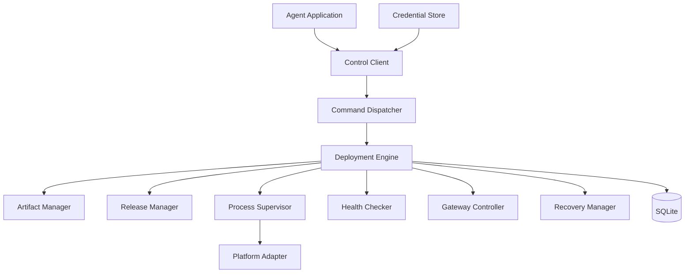

### 16.1 Agent modules

#### ControlClient

- maintains gRPC stream
- sends heartbeats
- receives commands
- uploads status events
- reconnects with backoff

#### CommandDispatcher

- validates command identity
- rejects expired commands
- enforces idempotency
- routes commands to deployment engine

#### DeploymentEngine

- owns deployment state machine
- persists every state transition
- executes compensating rollback actions

#### ArtifactManager

- selects artifact provider
- downloads and verifies files
- manages local artifact cache

#### ReleaseManager

- creates immutable release directories
- activates and deactivates releases
- tracks active and previous release

#### ProcessSupervisor

- starts and stops processes
- captures exit code
- manages process groups
- monitors liveness
- handles graceful termination

#### HealthChecker

Supported types:

- process alive
- TCP connect
- HTTP status
- local command
- file presence

#### GatewayController

- registers blue/green upstreams
- switches active upstream
- begins draining
- confirms drain completion

#### RecoveryManager

- detects crash loops
- restarts managed applications
- triggers rollback
- recovers after device reboot

#### LocalStore

SQLite tables:

- agent_identity
- deployment_commands
- deployment_state
- release_inventory
- artifact_chunks
- pending_events
- process_state
- recovery_state

---

## 17. Platform Abstraction

### 17.1 Interface example

```cpp
class IProcessSupervisor
{
public:
    virtual ~IProcessSupervisor() = default;

    virtual StartProcessResult start(
        const ProcessStartOptions& options) = 0;

    virtual StopProcessResult stop(
        const ProcessHandle& process,
        std::chrono::seconds timeout) = 0;

    virtual ProcessStatus status(
        const ProcessHandle& process) const = 0;
};
```

### 17.2 Windows implementation

Use:

- Windows Service for Agent installation
- `CreateProcessW`
- Job Objects
- process handles
- named pipes where local IPC is needed
- ACL-protected data directories
- Windows Credential Manager or DPAPI for secrets
- graceful stop message followed by process termination fallback

### 17.3 Linux implementation

Use:

- systemd service for Agent installation
- `posix_spawn` or `fork/exec`
- process groups
- Unix signals
- Unix domain sockets where local IPC is needed
- filesystem permissions
- libsecret or encrypted credential file
- graceful `SIGTERM`, then `SIGKILL` fallback

### 17.4 Architecture support

Initial support:

- Windows x86_64
- Linux x86_64
- Linux ARM64

ARM32 and other targets should be deferred until the core architecture is stable.

---

## 18. Release Directory Layout

```text
yirang/
├── agent/
├── data/
│   ├── agent.db
│   └── credentials/
├── artifacts/
├── releases/
│   └── kiosk-client/
│       ├── 2.1.0/
│       ├── 2.2.0/
│       └── 2.3.0/
├── active/
│   └── kiosk-client -> ../releases/kiosk-client/2.3.0
├── logs/
└── temp/
```

On Windows, where symbolic links may require privileges, activation may be represented by:

- an atomic metadata pointer in SQLite
- a small launcher configuration file
- a directory junction when permitted

The active release should not be modified in place.

---

## 19. Deployment State Machine

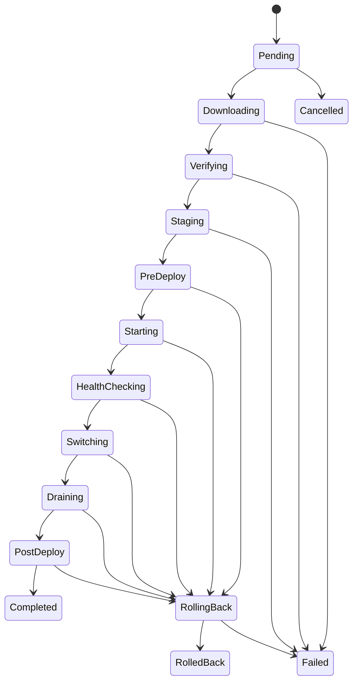

### 19.1 States

- `PENDING`
- `DOWNLOADING`
- `VERIFYING`
- `STAGING`
- `PRE_DEPLOY`
- `STARTING`
- `HEALTH_CHECKING`
- `SWITCHING`
- `DRAINING`
- `POST_DEPLOY`
- `COMPLETED`
- `ROLLING_BACK`
- `ROLLED_BACK`
- `FAILED`
- `CANCELLED`
- `PAUSED`

### 19.2 Idempotency

Every deployment command has:

- command_id
- deployment_id
- device_id
- sequence number
- expiration time
- command hash

The Agent stores completed command IDs. Repeated delivery returns the previous result rather than repeating side effects.

### 19.3 Persistence

The Agent persists state before executing each external side effect.

Example:

1. persist `STARTING`
2. create process
3. persist process handle metadata
4. emit event

This reduces ambiguity after Agent or device restart.

---

## 20. Recreate Deployment Sequence

Used for legacy or fixed-port applications.

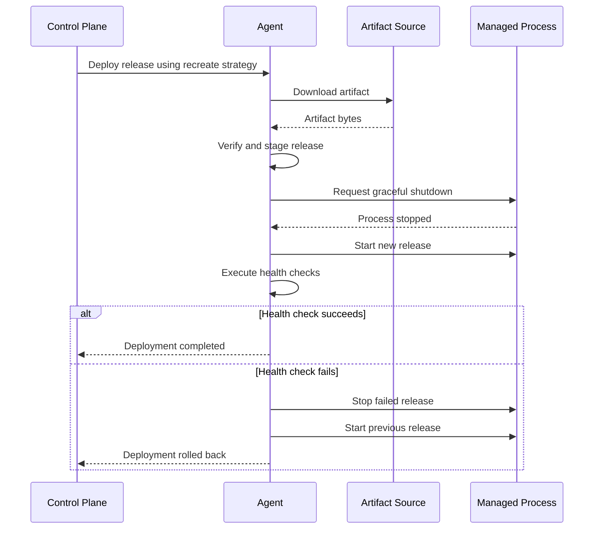

Expected downtime exists between old process stop and new process readiness.

---

## 21. Blue-Green Deployment Architecture

### 21.1 Preconditions

A service is blue-green capable when:

- it can bind to a dynamically assigned local port
- it provides a reliable readiness health check
- persistent state is externalized or backward compatible
- two instances can temporarily coexist
- the Local Gateway can route traffic to either instance

### 21.2 Local topology

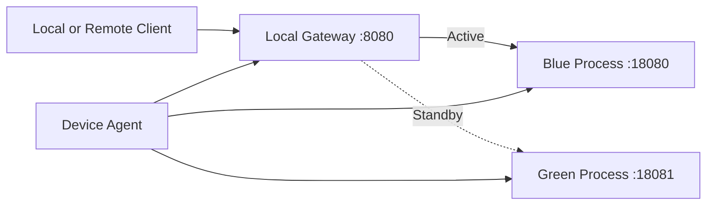

### 21.3 Deployment sequence

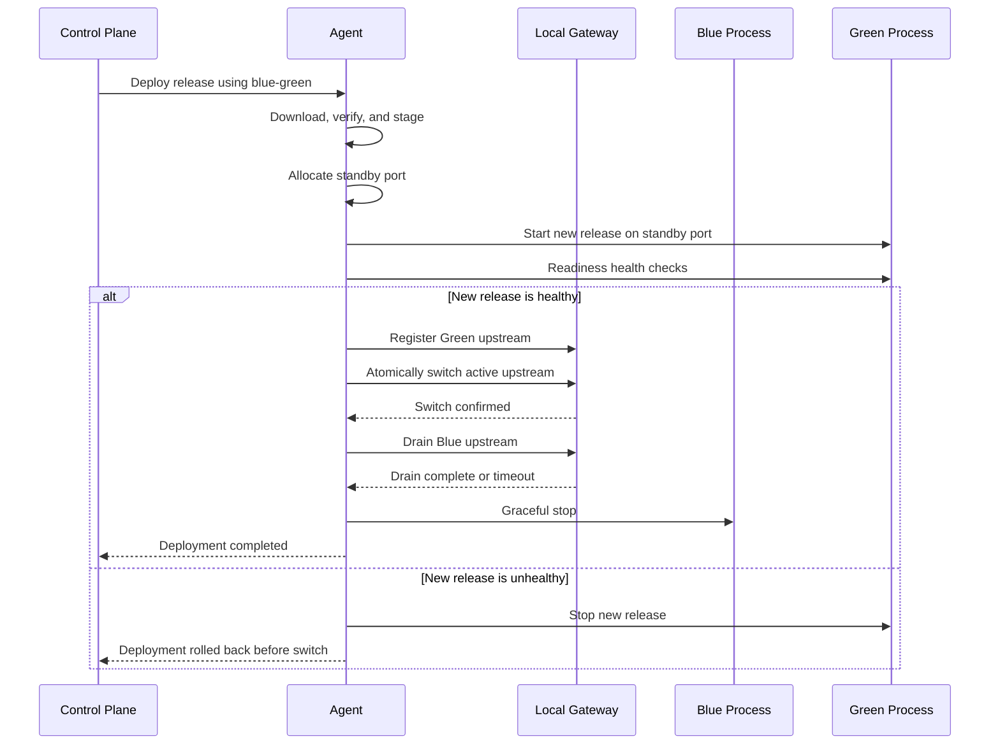

### 21.4 Gateway scope

The Local Gateway should remain intentionally small.

Supported MVP functionality:

- TCP forwarding
- optional HTTP reverse proxy
- upstream registration
- atomic active-upstream switching
- connection draining
- active connection count
- local admin endpoint protected by local authentication

Not supported:

- service mesh
- distributed routing
- global load balancing
- advanced L7 policy language
- certificate authority platform
- generalized ingress controller

### 21.5 Long-lived connections

For TCP or WebSocket services, existing connections may remain attached to the old process while new connections route to the new process.

The Gateway should:

1. stop assigning new connections to Blue
2. keep existing Blue connections
3. wait until connection count reaches zero or timeout expires
4. request old process shutdown

---

## 22. Health Checking

### 22.1 Health check types

#### Process check

Confirms that the process is running.

#### TCP check

Attempts connection to a local port.

#### HTTP check

Validates:

- connection
- timeout
- expected status code
- optional response body pattern

#### Command check

Runs a predefined local checker binary with fixed arguments.

Arbitrary user-supplied shell execution should not be supported.

### 22.2 Readiness and liveness

Readiness determines whether traffic may be switched.

Liveness determines whether an already active process should be restarted or rolled back.

### 22.3 Stability window

A deployment should not be marked fully stable immediately after traffic switching.

Example policy:

```yaml
health:
  readiness_success_threshold: 3
  post_switch_stability_seconds: 120
  max_process_restarts: 3
  rollback_on_crash_loop: true
```

---

## 23. Watchdog and Self-Healing

Self-healing is a baseline feature, not an optional late-stage feature.

### 23.1 Behavior

The Agent monitors:

- process existence
- exit code
- health-check status
- restart frequency
- current active release
- gateway upstream state

### 23.2 Crash-loop detection

Example:

```text
3 failures within 120 seconds
```

Response:

1. stop restarting the failed release
2. reactivate the previous release
3. restore gateway route
4. mark deployment as auto-rolled-back
5. notify Control Plane after connectivity is available

### 23.3 Device restart recovery

After boot:

1. Agent service starts
2. Agent loads local state
3. Agent validates active release
4. Agent starts required managed processes
5. Agent restores Gateway route
6. Agent resumes or reconciles interrupted deployment
7. Agent reconnects to Control Plane

---

## 24. Site Relay Architecture

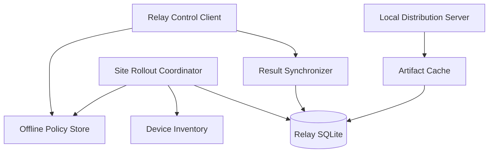

### 24.1 Site Relay responsibilities

- maintain outbound authenticated Control Plane connection
- download each required artifact once per site
- verify and cache artifacts
- provide HTTPS range downloads to local Agents
- track site-local device progress
- enforce deployment concurrency limits
- continue valid authorized deployments during WAN outage
- stop when policy expiration or failure threshold is reached
- upload results after reconnection
- evict unused artifacts safely

### 24.2 Site Relay is not

- a general local package repository
- a generic forward proxy
- a peer-to-peer network
- a full local Control Plane
- an unrestricted remote execution server

---

## 25. Site Relay Artifact Distribution Sequence

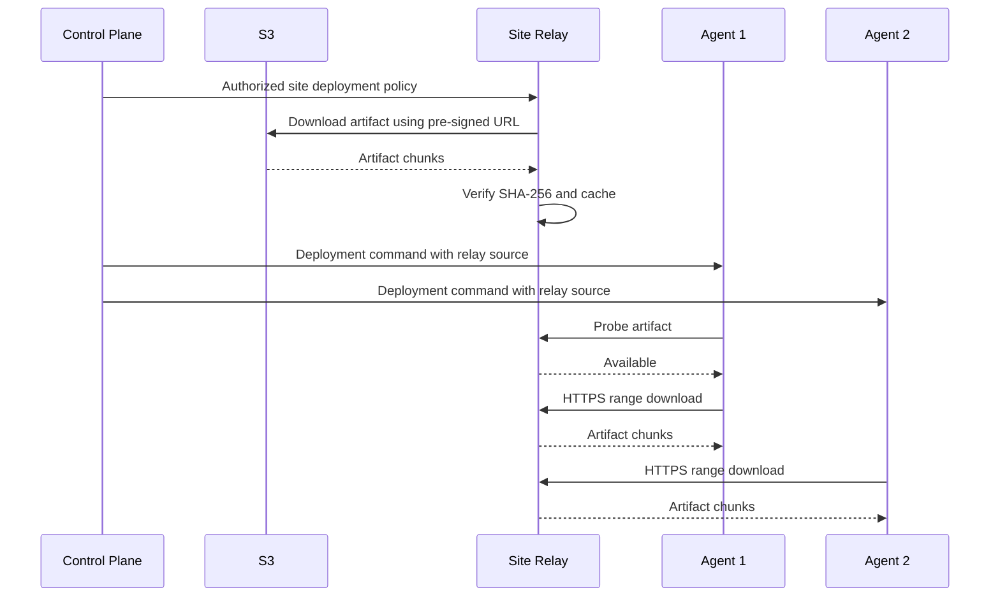

### 25.1 WAN bandwidth reduction

For an artifact of size `A` and `N` devices:

Without Site Relay:

```text
WAN transfer ≈ A × N
```

With Site Relay:

```text
WAN transfer ≈ A
LAN transfer ≈ A × N
```

This is a core product advantage for distributed physical sites.

---

## 26. Offline-Resilient Deployment

### 26.1 Authorization principle

Site Relay may continue only a deployment that was explicitly authorized while connected.

The authorization envelope includes:

- deployment ID
- site ID
- release ID
- eligible device selector
- not-before time
- expiration time
- maximum parallel devices
- failure threshold
- artifact hash
- allowed strategy
- digital signature

### 26.2 Example authorization envelope

```json
{
  "deployment_id": "dep_01KIOSK",
  "site_id": "site_seoul_001",
  "release_id": "rel_2_3_0",
  "not_before": "2026-08-07T02:00:00+09:00",
  "expires_at": "2026-08-08T06:00:00+09:00",
  "device_selector": {
    "group": "store-kiosks"
  },
  "rollout": {
    "max_parallel": 5,
    "batch_size": 10,
    "failure_threshold_percent": 10
  },
  "artifact": {
    "sha256": "9f2a..."
  },
  "signature": "base64-signature"
}
```

### 26.3 Offline behavior

During WAN outage, Site Relay may:

- distribute a cached authorized artifact
- start scheduled deployment within the authorized window
- enforce target group and concurrency limits
- pause deployment when failure threshold is exceeded
- collect device results locally

It may not:

- create new releases
- change target groups
- extend authorization expiration
- deploy an unapproved artifact
- change security policy
- bypass a failed signature check

### 26.4 Reconnection synchronization

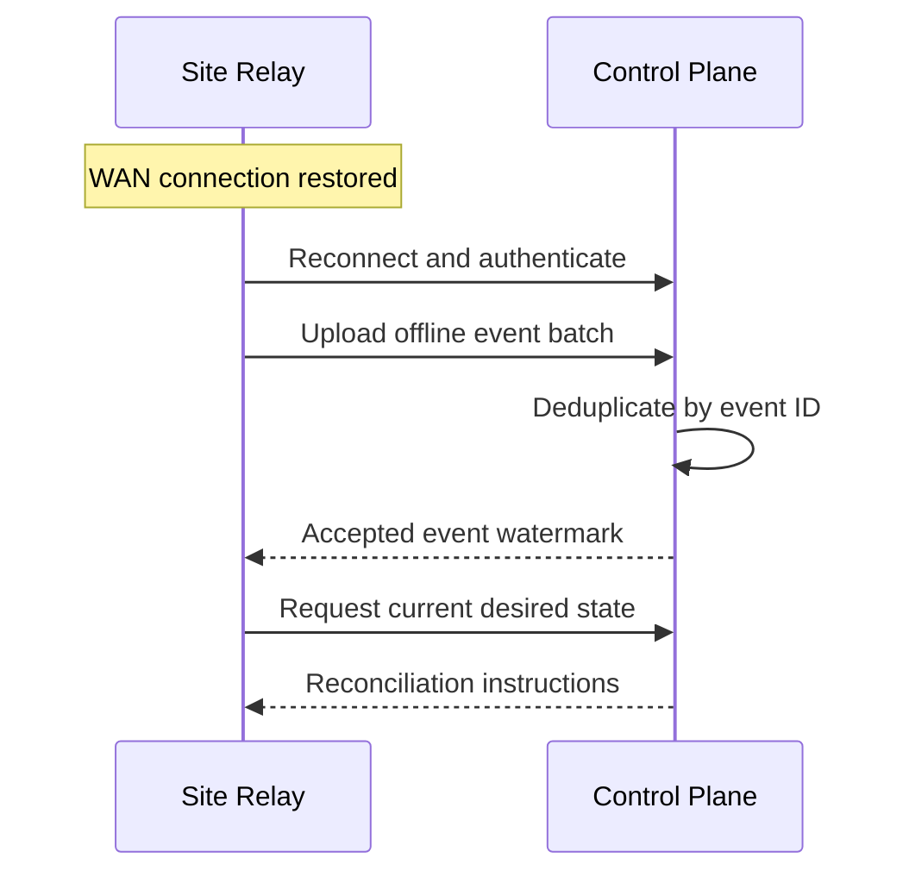

---

## 27. Site-Level Rollout Strategy

### 27.1 Pilot batch

Recommended default:

```text
Batch 1: 1–2 pilot devices
Batch 2: 10% of site
Batch 3: remaining devices
```

### 27.2 Policy example

```yaml
rollout:
  strategy: site_batches
  first_batch_size: 2
  batch_size: 10
  max_parallel: 5
  pause_after_first_batch_seconds: 300
  failure_threshold_percent: 10
  stop_on_critical_failure: true
```

### 27.3 Failure handling

The Site Relay pauses the rollout when:

- failure threshold is exceeded
- artifact verification fails
- authorization expires
- pilot devices fail
- local disk space becomes insufficient
- Agent compatibility requirements are not met

The Control Plane or authorized operator must explicitly resume after policy failure.

---

## 28. Cache Management

### 28.1 Cache policy

The Site Relay must protect:

- artifacts used by active deployments
- current active releases
- previous rollback releases
- scheduled deployment artifacts

Other artifacts may be evicted using LRU.

### 28.2 Example configuration

```yaml
cache:
  max_size_gb: 50
  min_free_space_gb: 10
  keep_previous_releases: 2
  cleanup_interval_minutes: 30
```

### 28.3 Eviction order

1. expired incomplete downloads
2. unreferenced old artifacts
3. completed releases older than retention
4. never evict protected active or rollback artifacts

---

## 29. Control Plane Services

### 29.1 API service

Responsibilities:

- user authentication
- organization/project/site/device APIs
- release creation
- deployment creation
- deployment approval
- query APIs
- signed upload URL generation

### 29.2 Deployment Orchestrator

Responsibilities:

- resolve target selector
- create device deployment records
- manage batch progression
- enforce approval and schedule
- pause, resume, cancel, and rollback
- calculate aggregate deployment status
- publish commands to Agent Gateway
- process Agent events

### 29.3 Agent Gateway

Responsibilities:

- authenticate Agent and Relay streams
- track online sessions
- deliver commands
- receive heartbeat and progress events
- apply rate limits
- forward events asynchronously

### 29.4 Artifact Service

Responsibilities:

- validate artifact metadata
- generate upload pre-signed URLs
- finalize uploaded artifacts
- verify object presence and size
- generate download pre-signed URLs
- optionally proxy downloads as fallback

### 29.5 Audit Service

Records:

- login
- Agent enrollment
- release creation
- deployment creation
- approval
- cancellation
- rollback
- policy changes
- role changes
- Site Relay offline execution

### 29.6 Notification Service

Initial outputs:

- webhook
- Slack webhook
- email optional

Notifications:

- deployment started
- pilot batch failed
- rollout paused
- deployment completed
- rollback executed
- device offline beyond threshold

---

## 30. Messaging and Persistence

### 30.1 PostgreSQL

PostgreSQL is the source of truth for:

- tenants
- users
- projects
- sites
- devices
- releases
- deployments
- approvals
- audit records

### 30.2 RabbitMQ

RabbitMQ is used for:

- deployment command events
- Agent status events
- notification jobs
- artifact finalization jobs
- batch progression jobs

RabbitMQ is not the source of truth.

### 30.3 Redis

Redis is used for ephemeral data:

- active Agent session routing
- heartbeat TTL
- short-lived distributed locks
- rate-limit counters
- cached deployment summary

The system must remain recoverable from PostgreSQL if Redis is lost.

### 30.4 Outbox pattern

The Control Plane should use a transactional outbox.

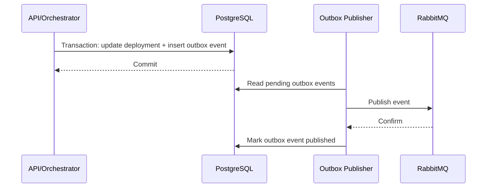

This prevents database state and message publication from diverging.

---

## 31. Security Architecture

### 31.1 Agent enrollment

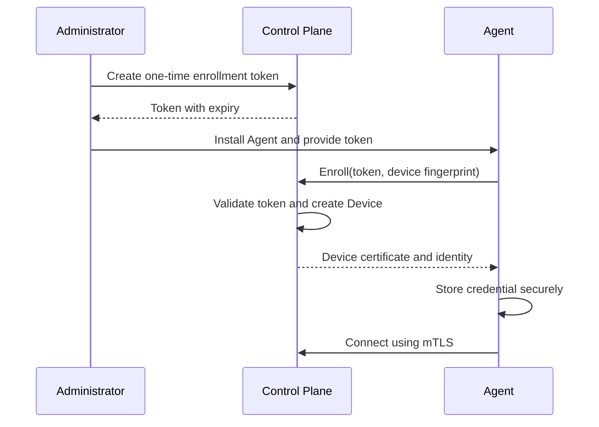

### 31.2 Credential storage

Windows:

- DPAPI
- ACL-protected file
- optional Windows Certificate Store

Linux:

- root-owned encrypted file
- strict file permissions
- optional system keyring

### 31.3 Artifact integrity

Required:

- SHA-256 artifact hash
- TLS transport
- manifest signature
- optional package signature
- strict path validation
- no execution before verification

### 31.4 Release signing

A release is signed after artifact finalization.

The Agent verifies:

1. trusted signing key
2. manifest signature
3. artifact hash
4. deployment authorization
5. command expiration

### 31.5 RBAC

Suggested roles:

- Organization Admin
- Project Admin
- Release Manager
- Deployment Approver
- Operator
- Viewer

Production deployment may require separation between creator and approver.

### 31.6 Least privilege

The Agent may require elevated rights to manage services, but managed applications should run under dedicated lower-privilege accounts where possible.

### 31.7 Hook security

Pre/post-deploy hooks are high-risk.

MVP policy:

- disabled by default
- only packaged signed executables
- no arbitrary inline shell text
- fixed timeout
- output captured
- explicit allowlist policy
- no network access restrictions unless implemented by the OS

---

## 32. Observability

### 32.1 Agent telemetry

Minimal telemetry:

- Agent online status
- Agent version
- current release
- process status
- deployment state
- artifact progress
- last error
- disk availability
- optional CPU and memory summary

### 32.2 Logging

All logs should be structured.

Example fields:

```json
{
  "timestamp": "2026-08-06T18:00:00+09:00",
  "level": "INFO",
  "component": "deployment-engine",
  "device_id": "dev_001",
  "deployment_id": "dep_001",
  "release_id": "rel_230",
  "event": "health_check_succeeded"
}
```

### 32.3 Metrics

Control Plane metrics:

- connected Agents
- connected Site Relays
- deployment success rate
- average deployment duration
- artifact download throughput
- rollback count
- command delivery latency

Site Relay metrics:

- cache hit ratio
- cache disk use
- WAN bytes downloaded
- LAN bytes served
- active local downloads
- offline event backlog

### 32.4 Scope limit

The project should expose metrics to Prometheus but should not build a full metrics database or dashboard engine.

---

## 33. API Outline

### 33.1 Release APIs

```text
POST   /api/v1/projects/{project_id}/artifacts/upload-url
POST   /api/v1/projects/{project_id}/artifacts/finalize
POST   /api/v1/services/{service_id}/releases
GET    /api/v1/services/{service_id}/releases
GET    /api/v1/releases/{release_id}
```

### 33.2 Deployment APIs

```text
POST   /api/v1/deployments
GET    /api/v1/deployments/{deployment_id}
POST   /api/v1/deployments/{deployment_id}/approve
POST   /api/v1/deployments/{deployment_id}/pause
POST   /api/v1/deployments/{deployment_id}/resume
POST   /api/v1/deployments/{deployment_id}/cancel
POST   /api/v1/deployments/{deployment_id}/rollback
GET    /api/v1/deployments/{deployment_id}/events
```

### 33.3 Device APIs

```text
POST   /api/v1/agents/enrollment-tokens
GET    /api/v1/devices
GET    /api/v1/devices/{device_id}
POST   /api/v1/devices/{device_id}/labels
GET    /api/v1/sites/{site_id}/devices
```

### 33.4 Site Relay APIs

```text
POST   /api/v1/relays/enrollment-tokens
GET    /api/v1/sites/{site_id}/relays
GET    /api/v1/relays/{relay_id}/cache
GET    /api/v1/relays/{relay_id}/offline-events
```

---

## 34. CLI Design

```bash
yirang login

yirang project create \
  --name kiosk-platform

yirang release create \
  --service kiosk-client \
  --version 2.3.0 \
  --file ./kiosk-client-2.3.0.zip

yirang deploy create \
  --release 2.3.0 \
  --environment production \
  --site-group korea-stores \
  --strategy site-batches \
  --first-batch 2 \
  --batch-size 10 \
  --max-parallel 5

yirang deploy approve \
  --deployment dep_01KIOSK

yirang deploy watch \
  --deployment dep_01KIOSK

yirang device list \
  --site seoul-store-001 \
  --outdated

yirang deploy rollback \
  --deployment dep_01KIOSK
```

The CLI communicates only with the Control Plane.

---

## 35. End-to-End Release Sequence

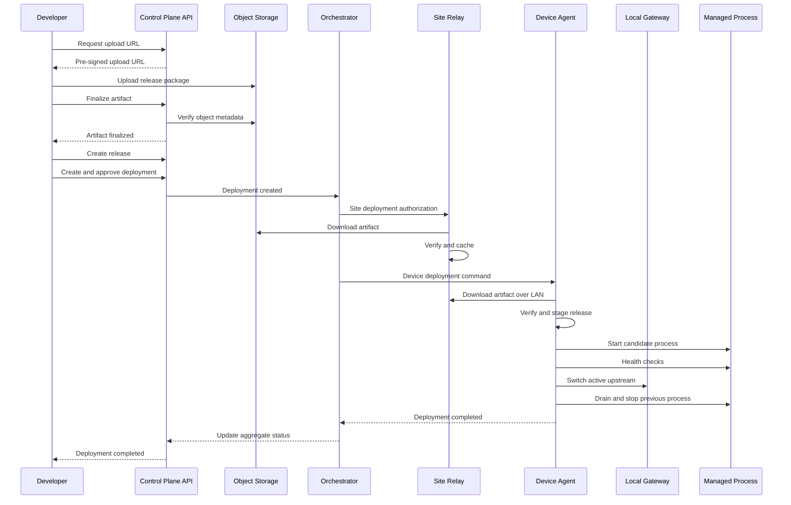

---

## 36. Failure Scenarios and Recovery

### 36.1 Download interruption

Behavior:

- persist completed chunks
- retry with backoff
- resume using Range
- switch provider after configured failures

### 36.2 Artifact hash mismatch

Behavior:

- delete corrupted temporary file
- mark source attempt failed
- retry from another provider once
- fail deployment if mismatch persists
- emit security-relevant event

### 36.3 Agent restart during deployment

Behavior:

- load persisted deployment state
- inspect process and files
- resume idempotent step
- roll back if state is ambiguous and safe continuation is impossible

### 36.4 Device power loss during traffic switch

Behavior:

- Local Gateway state must be persisted atomically
- after restart, Agent validates active process
- if candidate is healthy, restore candidate route
- otherwise restore previous release

### 36.5 Control Plane unavailable

Behavior:

- active application continues running
- Agent retains local watchdog
- Agent queues events
- previously authorized local deployment may continue through Site Relay
- no new unauthorized deployment begins

### 36.6 Site Relay unavailable

Behavior:

- Agent tries S3
- Agent then tries cloud relay
- deployment may pause if policy requires Site Relay only

### 36.7 Site Relay disk full

Behavior:

- clean unprotected cache
- reject new artifact if minimum free space cannot be met
- notify Control Plane
- never evict an active rollback artifact

### 36.8 Health check failure before switch

Behavior:

- stop candidate
- keep current process active
- mark deployment failed or rolled back

### 36.9 Failure after switch

Behavior:

- switch Gateway back to previous process when still available
- restart previous release if needed
- stop candidate
- mark auto-rollback

### 36.10 Partial site failure

Behavior:

- calculate failure rate per completed batch
- pause when threshold exceeded
- do not continue to later batches
- retain successful devices unless policy requests group rollback

---

## 37. Consistency and Reconciliation

### 37.1 Control Plane desired state

The Control Plane stores the intended release for each device.

### 37.2 Agent observed state

The Agent reports:

- active release
- process state
- deployment state
- artifact inventory
- Agent version

### 37.3 Reconciliation cases

| Desired | Observed | Action |
|---|---|---|
| Release 2.3 | Release 2.3 healthy | No action |
| Release 2.3 | Release 2.2 healthy | Resume or redeploy |
| Release 2.3 | Release 2.3 unhealthy | Restart or rollback |
| Release 2.2 | Release 2.3 | Roll back only if explicitly ordered |
| No managed service | Process running | Report drift; do not kill automatically |

The reconciliation system must remain narrow and predictable.

---

## 38. Database Schema Outline

Core tables:

```text
organizations
users
organization_members
projects
environments
sites
device_groups
devices
site_relays
services
artifacts
releases
deployments
deployment_targets
device_deployments
deployment_events
approvals
audit_logs
enrollment_tokens
signing_keys
outbox_events
```

Important constraints:

- unique release version per service
- immutable finalized artifact hash
- unique device identity
- unique event ID for deduplication
- explicit foreign keys
- append-only audit records
- deployment state transition validation in application logic

---

## 39. MVP Roadmap

All four MVP stages are planned for implementation. Each stage should be independently demonstrable.

---

## 40. MVP 1 — Single-Device Reliable Deployment

### 40.1 Goal

Prove that a Windows or Linux Agent can reliably receive, install, start, monitor, and roll back a native release.

### 40.2 Scope

- Agent enrollment
- outbound authenticated connection
- heartbeat
- device inventory
- release upload
- S3/MinIO artifact storage
- SHA-256 verification
- versioned release directories
- process start and stop
- process status reporting
- HTTP/TCP/process health checks
- recreate deployment
- automatic rollback
- watchdog restart
- crash-loop detection
- Agent restart recovery
- deployment event log
- minimal CLI or API
- Windows x64 support
- Linux x64 support

### 40.3 Demo scenario

1. Register one Windows Agent.
2. Upload sample kiosk version 1.0.
3. Deploy successfully.
4. Upload version 1.1 with failing health check.
5. Observe automatic rollback to 1.0.
6. Kill the active process.
7. Observe watchdog restart.
8. Restart the device.
9. Observe application recovery.

### 40.4 Acceptance criteria

- deployment state survives Agent restart
- failed health check does not leave the device without a running previous release
- corrupted artifact is rejected
- duplicate deployment command is idempotent
- Agent does not require inbound ports

---

## 41. MVP 2 — Zero-Downtime Deployment

### 41.1 Goal

Provide blue-green process switching and fallback artifact relay.

### 41.2 Scope

- Local Gateway
- dynamic port allocation
- blue-green deployment
- readiness health checks
- atomic route switch
- connection draining
- post-switch stability window
- rollback after switch
- cloud artifact relay
- resumable HTTP range downloads
- deployment log streaming
- Windows and Linux Gateway support
- sample HTTP and TCP services

### 41.3 Demo scenario

1. Run sample service version 1.0 through Local Gateway.
2. Continuously send requests.
3. Deploy version 1.1 on a standby port.
4. Verify no failed client requests during switch.
5. Deploy a version that crashes after switching.
6. Observe automatic route restoration to previous release.

### 41.4 Acceptance criteria

- no new connections are sent to the draining process
- active client traffic continues during a successful deployment
- route state is restored after device restart
- failed candidate never replaces the healthy active release permanently
- fixed-port legacy applications can still use recreate strategy

---

## 42. MVP 3 — SaaS Fleet Management

### 42.1 Goal

Transform the deployment engine into a multi-user fleet management product.

### 42.2 Scope

- organizations
- projects
- environments
- sites
- device groups
- RBAC
- release history
- deployment approval
- scheduled deployment
- target selectors
- rolling and batch deployment
- pilot batch
- pause, resume, cancel
- manual rollback
- audit log
- version distribution dashboard
- device status dashboard
- webhook and Slack notification
- PostgreSQL source of truth
- RabbitMQ event processing
- Redis session routing
- transactional outbox

### 42.3 Demo scenario

1. Create production and staging environments.
2. Assign 20 devices to two sites.
3. Upload release.
4. Require a second user to approve production deployment.
5. Deploy to two pilot devices.
6. Continue in batches of five.
7. Pause on a simulated failure threshold.
8. Resume after operator approval.
9. Review complete audit history.

### 42.4 Acceptance criteria

- unauthorized users cannot deploy to production
- audit history records create, approve, pause, resume, cancel, and rollback operations
- target resolution is deterministic
- deployment aggregate state matches per-device state
- Control Plane restart does not lose rollout progress

---

## 43. MVP 4 — Edge Fleet Deployment with Site Relay

### 43.1 Goal

Optimize large physical sites and tolerate intermittent WAN connectivity.

### 43.2 Scope

- Site Relay enrollment
- Site Relay outbound control connection
- content-addressed artifact cache
- artifact prefetch
- LAN HTTPS distribution
- HTTP Range support
- chunk state persistence
- Agent source fallback
- site-local rollout coordinator
- offline authorization envelope
- scheduled offline execution
- offline event queue
- reconnection synchronization
- site-level failure threshold
- site-level concurrency limit
- cache eviction
- Relay metrics
- Relay high-availability deferred

### 43.3 Demo scenario

1. Register one Site Relay and ten local Agents.
2. Upload a 300 MB release.
3. Confirm the Relay downloads the artifact once.
4. Confirm all Agents download through LAN.
5. Disconnect Site Relay WAN.
6. Run a previously approved scheduled deployment.
7. Reconnect WAN.
8. Observe event synchronization and final Control Plane status.
9. Simulate pilot failures and observe site rollout pause.

### 43.4 Acceptance criteria

- WAN artifact download occurs once per site for cache hit scenario
- offline deployment cannot exceed signed authorization scope
- expired authorization is rejected
- event synchronization is deduplicated
- active and rollback artifacts are never evicted
- Agents can fall back to S3 when permitted

---

## 44. Implementation Order

Recommended implementation order:

### Phase 1: Foundation

- common error model
- structured logger
- Protocol Buffers
- SQLite wrapper
- platform process abstraction
- Agent local state machine

### Phase 2: MVP 1 core

- Control Plane minimal API
- Agent enrollment
- heartbeat
- artifact upload/download
- recreate deployment
- health checks
- rollback
- watchdog

### Phase 3: MVP 2

- Local Gateway
- blue-green
- draining
- range downloads
- cloud relay
- traffic test harness

### Phase 4: MVP 3

- tenant/domain model
- RBAC
- approval
- batching
- orchestration
- audit
- dashboard
- notifications

### Phase 5: MVP 4

- Site Relay cache
- local distribution
- offline authorization
- local rollout coordination
- synchronization
- cache eviction

### Phase 6: Hardening

- fault injection
- installer packaging
- performance testing
- security review
- migration strategy
- documentation
- end-to-end demo environment

---

## 45. Testing Strategy

### 45.1 Unit tests

- state transition validation
- retry policy
- artifact selection
- hash verification
- cache eviction
- authorization expiry
- target selector
- rollout failure threshold
- crash-loop detection

### 45.2 Integration tests

- Agent ↔ Agent Gateway
- Agent ↔ S3/MinIO
- Agent ↔ Site Relay
- Agent ↔ Local Gateway
- Orchestrator ↔ RabbitMQ/PostgreSQL
- offline event synchronization

### 45.3 End-to-end tests

- successful recreate deployment
- failed recreate rollback
- successful blue-green deployment
- post-switch failure rollback
- rolling deployment across devices
- pilot batch pause
- offline Site Relay deployment
- device restart during deployment
- Agent reconnect after network partition

### 45.4 Fault-injection tests

Inject:

- process crash
- Agent crash
- Site Relay crash
- Control Plane restart
- network disconnect
- packet delay
- disk full
- corrupted artifact
- S3 timeout
- duplicate command
- out-of-order event
- expired authorization

### 45.5 Performance tests

Measure:

- maximum concurrent Agent streams
- heartbeat throughput
- command delivery latency
- artifact throughput from Site Relay
- cache hit ratio
- deployment event ingestion
- Gateway connection switch behavior

### 45.6 Platform test matrix

| Platform | Agent | Gateway | Site Relay |
|---|---|---|---|
| Windows x64 | Required | Required | Optional |
| Linux x64 | Required | Required | Required |
| Linux ARM64 | Required by MVP 4 completion | Required where supported | Optional |
| macOS | Development only | Not product target | Not product target |

---

## 46. CI/CD Plan

GitHub Actions pipelines:

### Pull request

- formatting
- static analysis
- unit tests
- Linux build
- Windows build
- Protocol Buffer compatibility check

### Main branch

- integration tests
- Docker Compose Control Plane
- MinIO and RabbitMQ test environment
- sample deployment E2E

### Release

- signed Windows MSI or ZIP
- Linux DEB/RPM or tar package
- Site Relay package
- Control Plane container images
- CLI binaries
- SBOM
- checksums
- release notes

Recommended tools:

- clang-format
- clang-tidy
- MSVC warnings
- AddressSanitizer on Linux
- UBSan on Linux
- CodeQL or equivalent
- CTest
- GoogleTest

---

## 47. Packaging and Installation

### 47.1 Windows Agent

- MSI installer
- installs Windows Service
- creates protected data directory
- configures recovery restart
- optional enrollment token argument

Example:

```powershell
msiexec /i yirang-agent.msi ENROLLMENT_TOKEN=xxxx /quiet
```

### 47.2 Linux Agent

- DEB/RPM or tarball
- systemd service
- dedicated user
- protected state directory

Example:

```bash
sudo yirang-agent enroll --token xxxx
sudo systemctl enable --now yirang-agent
```

### 47.3 Site Relay

Prefer Linux deployment for MVP 4, with Windows support optional.

Site Relay may run:

- as a native systemd service
- as a Docker container in the customer site
- on a small x86 mini PC

---

## 48. Configuration Model

### 48.1 Agent configuration

```yaml
agent:
  control_plane: https://control.example.com
  heartbeat_seconds: 15
  reconnect_max_seconds: 30

storage:
  data_directory: /var/lib/yirang
  artifact_cache_gb: 5
  keep_previous_releases: 2

security:
  verify_release_signature: true

gateway:
  enabled: true
  admin_endpoint: unix:///run/yirang-gateway.sock
```

### 48.2 Site Relay configuration

```yaml
relay:
  control_plane: https://control.example.com
  listen_address: 0.0.0.0
  listen_port: 9443

cache:
  directory: /var/lib/yirang-relay/artifacts
  max_size_gb: 50
  min_free_space_gb: 10

distribution:
  max_parallel_downloads: 50
  rate_limit_mbps: 500

offline:
  enabled: true
  max_event_backlog: 100000
```

Configuration values containing secrets should reference secure storage rather than embed plaintext.

---

## 49. Versioning and Compatibility

### 49.1 Protocol compatibility

Every gRPC message includes:

- protocol version
- Agent version
- capability list

The Control Plane should avoid issuing commands unsupported by the Agent.

### 49.2 Manifest compatibility

The Agent rejects unknown mandatory manifest fields but ignores unknown optional fields.

### 49.3 Agent upgrade

Self-update may be added only after MVP 4 core completion.

Agent self-update is high risk because it modifies the deployment mechanism itself. When implemented, it should use a separate bootstrapper and rollback path.

---

## 50. Deployment Policy Examples

### 50.1 Legacy kiosk

```yaml
deployment:
  strategy: recreate
  schedule: "02:00-04:00"
  max_parallel: 1
  rollback_on_failure: true
```

### 50.2 Blue-green edge service

```yaml
deployment:
  strategy: blue_green
  readiness_timeout_seconds: 60
  drain_timeout_seconds: 30
  post_switch_stability_seconds: 120
  rollback_on_failure: true
```

### 50.3 Multi-site rollout

```yaml
rollout:
  site_order:
    - pilot-sites
    - standard-sites
  first_batch_size: 2
  batch_size: 10
  max_parallel_per_site: 5
  failure_threshold_percent: 10
```

---

## 51. Portfolio Demonstration Environment

A complete demonstration should include:

- one Control Plane deployed with Docker Compose
- PostgreSQL
- RabbitMQ
- Redis
- MinIO
- Web Console
- CLI
- one Linux Site Relay
- two Linux Agents
- two Windows Agents
- sample kiosk application
- sample HTTP service
- continuous request generator
- network fault simulation

### 51.1 Demo story

1. Create an organization and project.
2. Enroll a Site Relay and four devices.
3. Deploy version 1.0.
4. Upload version 1.1.
5. Approve production rollout.
6. Relay prefetches artifact once.
7. Two pilot devices deploy.
8. Remaining devices deploy in batches.
9. One device simulates a crash loop and rolls back.
10. WAN disconnects.
11. A pre-authorized deployment proceeds locally.
12. WAN reconnects.
13. Results synchronize.
14. Dashboard shows mixed release state and final remediation.

This story demonstrates the complete product value more clearly than implementing many unrelated features.

---

## 52. README Positioning

Recommended headline:

> **Lightweight zero-downtime deployment for Windows and Linux edge devices.**

Recommended description:

> `yirang-rollout` is an agent-based release platform for deploying native applications to kiosks, embedded devices, and edge systems. It supports signed artifacts, health-checked rollout, automatic rollback, blue-green process switching, fleet management, and site-local distribution through an offline-resilient Site Relay.

Recommended differentiation statement:

> It is not a Kubernetes replacement. It focuses on native executable deployment and recovery for explicitly managed edge devices without container orchestration or cluster-level operational complexity.

---

## 53. Architecture Decision Records

The repository should include ADR documents.

Recommended ADRs:

```text
docs/adr/
├── 0001-outbound-agent-connection.md
├── 0002-grpc-control-channel.md
├── 0003-separate-control-and-artifact-channels.md
├── 0004-s3-presigned-artifact-delivery.md
├── 0005-sqlite-agent-state.md
├── 0006-local-gateway-blue-green.md
├── 0007-site-relay-cache.md
├── 0008-offline-authorization-envelope.md
├── 0009-postgresql-source-of-truth.md
├── 0010-transactional-outbox.md
└── 0011-no-kubernetes-scheduler-scope.md
```

---

## 54. Final Architecture Principles

1. **Outbound-only device connectivity**
   - Target devices never require public inbound ports.

2. **Control and artifact paths are separate**
   - Commands remain lightweight while artifacts use scalable HTTP delivery.

3. **Artifacts are immutable and content-addressed**
   - Every installed release is reproducible and verifiable.

4. **Every deployment step is persisted**
   - Agent restart must not corrupt deployment state.

5. **Rollback is a first-class path**
   - Failure recovery is designed before deployment success.

6. **Site Relay reduces cost and increases resilience**
   - Artifacts are downloaded once per physical site and distributed over LAN.

7. **Offline execution is authorized, bounded, and signed**
   - Connectivity loss must not remove deployment safety controls.

8. **Blue-green is optional**
   - Applications that cannot support it use recreate deployment.

9. **Fleet orchestration is explicit**
   - Devices are targeted by site, group, labels, and policy; there is no generalized scheduler.

10. **The project deliberately stops before Kubernetes complexity**
    - No container runtime, overlay networking, storage orchestration, or arbitrary workload scheduling.

---

## 55. Definition of Completion

The project is considered functionally complete when all of the following are demonstrated:

### MVP 1

- reliable native executable deployment
- integrity verification
- watchdog recovery
- automatic rollback
- restart-safe Agent state

### MVP 2

- blue-green process deployment
- local traffic switching
- connection draining
- zero-downtime demonstration
- post-switch rollback

### MVP 3

- multi-user SaaS model
- RBAC and approval
- fleet and site management
- batch rollout
- audit logs
- deployment dashboard

### MVP 4

- Site Relay artifact cache
- single WAN download per site
- LAN distribution
- offline authorized rollout
- result synchronization
- cache and failure policy enforcement

The final product should remain explainable with one sentence:

> `yirang-rollout` safely deploys and recovers native Windows and Linux applications across distributed edge devices, using a lightweight Agent, centralized Control Plane, and offline-resilient Site Relay—without requiring Kubernetes.

